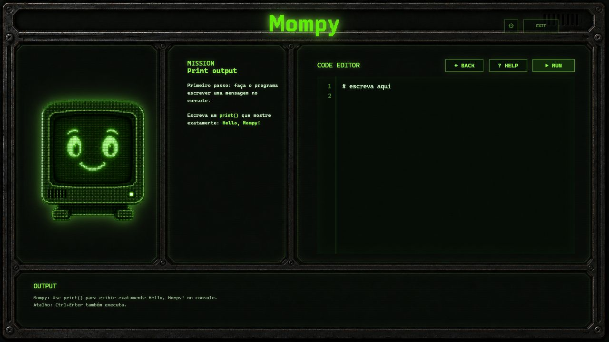

# Mompy


Mompy is a retro industrial Python learning app with guided lessons, missions,
local progress, XP and a desktop-first experience powered by Python.

Official site: [mompy.co](https://mompy.co)

## Preview



## What It Is

Mompy teaches Python through a calm CRT-style interface:

- guided lessons before each block of missions;
- 30 beginner-friendly missions;
- real Python validation in the backend;
- safe initial execution of learner code in a separate process;
- progress, XP and level controlled by Python;
- local-first desktop app with pywebview.

The visual layer stays in HTML/CSS/JavaScript. The app logic, mission data,
validation, progress, XP and desktop shell are Python.

## Architecture

```txt
mompy/
  frontend/
    index.html
    css/
    js/
    assets/

  backend/
    api.py
    missions.py
    lessons.py
    briefings.py
    validator.py
    progress.py
    xp.py
    code_runner.py
    storage.py

  data/
    progress.example.json

  tests/
  scripts/
    build_windows.ps1

  main.py
  requirements.txt
```

## Run From Source

Install dependencies:

```bash
python -m pip install -r requirements.txt
```

Open as a desktop app:

```bash
python main.py
```

Check the backend without opening a window:

```bash
python main.py --check
```

Run the browser preview for development:

```bash
python main.py --serve --port 8770
```

Then open:

```txt
http://127.0.0.1:8770/frontend/index.html
```

## Build For Windows

Generate a Windows desktop build with PyInstaller:

```powershell
powershell -ExecutionPolicy Bypass -File scripts/build_windows.ps1
```

Generate a zip package for a GitHub Release:

```powershell
powershell -ExecutionPolicy Bypass -File scripts/build_windows.ps1 -Zip
```

The build output is created under:

```txt
dist/Mompy/Mompy.exe
dist/Mompy-windows-x64.zip
```

Build outputs are ignored by Git and should be attached to GitHub Releases,
not committed to the repository.

## Tests

```bash
python -m unittest discover -s tests
```

## Releases

Installable builds will be published in GitHub Releases:

https://github.com/hepter-studios/mompy/releases

Do not assume a release exists until a tested package has been attached there.

## Platform Status

- Windows: build pipeline prepared and locally tested with PyInstaller.
- macOS: planned.
- Linux: planned.

## Roadmap Status

- 10.1: project organized and stable version saved.
- 10.2: frontend + Python backend architecture.
- 10.3: frontend connected to Python through pywebview/local API.
- 10.4: mission validation migrated to Python.
- 10.5: safer learner-code execution.
- 10.6: progress, XP and level controlled by Python.
- 10.7: Python desktop packaging prepared and locally tested.
